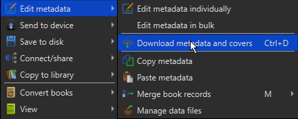

# Eka's Portal Plugin
[![License][license-image]][license-url]
[![calibre Version][calibre-image]][calibre-url]
[![Status][status-image]][status-image] 

## Overview

This plugin is for scraping book metadata from [Eka's Portal](https://aryion.com).

Books are linked with the `eka:` identifier. This id corresponds to the url of the book on Eka's Portal.

When you download a Book from Eka's Portal, it downloads with a specific naming scheme. For example: 
`https://aryion.com/g4/view/1152448` will download with the name `Gymmerical-1152448-DXD SHIT.docx`.

We can see the id is located in the name of the file, with that we can construct the url that is needed to fetch metadata.

Covers are not fetched with metadata, since covers on Eka's portal are not very good usually.

### Tutorials

#### Adding the Plugin to Calibre
1. Download the latest Eka's Portal plugin zip from https://github.com/jobobby04/calibre_plugins/releases/
2. At the top of Calibre, press `Preferences`
3. Select `Plugins` under `Advanced`
4. Click `Load plugin from file` and select the downloaded zip file

#### Setting up auto-convert to EPUB
I highly suggest setting up auto-convert to EPUB in Calibre, it makes downstream readers able to read anything your calibre insance distributes.
1. Expand the `Add books` option in Calibre
2. Select `Control the adding of Books`
3. Make sure `Read metadata from file contents` is disabled.
4. In the regular expression dropdown, select the simple `(?P<title>.+)` regex
5. Go to Automatic Adding, and set a folder for automatic importing.
6. In Ignore files, select `doc`, doc files are common in Eka's Portal, but are not directly supported for conversion in Calibre.
I suggest grabbing my scripts in the repositories `scripts` folder and copy them above your Import folder(you may need to edit the folder located in `ConvertDocToDocx.ps1`) to your actual import folder.
This set of scripts will allow you to convert most .doc files to .docx. But you may manually need to copy content from Word 1997 .doc files into new .docx files.

#### Downloading Metadata from Eka's Portal
1. Select all the imported books and right click them, then select `Edit metadata -> Download metadata and covers` 

2. Select `Configure download` 

3. Disable all Metadata sources other than EkaPortalPlugin 

4. This step is an optional one, one that is required if the book is private or contains tags that are hidden from public viewing.
Select EkaPortalPlugin and select `Configure selected source`. After that, get your Eka portal SID cookie from our browser. This is a temporary cookie that lasts for a short amount of time, so you will need to configure it again if you need it. Input it in the field and press `Save`. 

5. Close and select `Download only metadata` 

6. Click `Yes` after all the metadata has been fetched. 

7. Right-click the new books with Metadata, then `Edit metadata -> Edit metadata in bulk` 

8. Select `Generate default cover`, then press `OK` 

## Development / Contributions

All Jobobby04's calibre plugins are developed and maintained in GitHub at:
- https://github.com/jobobby04/calibre_plugins

Please see the README.md and CONTRIBUTING.md at the above site for more information.

[license-image]: https://img.shields.io/badge/License-GPL-yellow.svg
[license-url]: ../LICENSE.md

[calibre-image]: https://img.shields.io/badge/calibre-2.0.0-green
[calibre-url]: https://www.calibre-ebook.com/

[status-image]: https://img.shields.io/badge/Status-Stable-green
